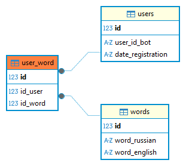

# Telegram-бот для изучения английского языка
Курсовая работа по предмету "Базы данных" на тему "Telegram-бот для изучения английского языка".

## Возможности
- Подтверждение верного ответа и повтор при ошибке
- Пользователь может добавлять и удалять свои слова (они видны только ему)

## Пошаговая настройка

### 1. Создание Telegram-бота и получение токена

#### Способ 1: Через @BotFather в Telegram
1. Откройте Telegram и найдите [@BotFather](https://t.me/botfather)
2. Отправьте команду `/newbot`
3. Укажите имя бота (например: "Netology_dict")
4. Укажите username (например: "netology_dict_bot") - должен заканчиваться на `_bot`
5. Скопируйте полученный токен (выглядит как `123456789:ABCdefGHIjklMNOpqrsTUVwxyz`)

#### Способ 2: Через веб-интерфейс
1. Перейдите на [@BotFather](https://t.me/botfather) в браузере
2. Нажмите "Start" или отправьте `/start`
3. Выберите "Create a new bot" или отправьте `/newbot`
4. Следуйте инструкциям

#### Важно:
- **Сохраните токен** - он понадобится для настройки
- **Не делитесь токеном** - это ключ доступа к вашему боту
- **Токен можно пересоздать** командой `/revoke` у @BotFather

### 2. Установка зависимостей
```bash
# Создание виртуального окружения
python3 -m venv .venv

# Активация (macOS/Linux)
source .venv/bin/activate

# Установка пакетов
pip install -r requirements.txt
```

### 3. Настройка PostgreSQL

#### Установка PostgreSQL (macOS)
```bash
# Установка через Homebrew
brew install postgresql@14

# Запуск службы
brew services start postgresql@14

# Проверка статуса
brew services list | grep postgres
```

#### Установка PostgreSQL (Ubuntu/Debian)
```bash
# Обновление пакетов
sudo apt update

# Установка PostgreSQL
sudo apt install postgresql postgresql-contrib

# Запуск службы
sudo systemctl start postgresql
sudo systemctl enable postgresql
```

#### Установка PostgreSQL (Windows)
1. Скачайте установщик с [официального сайта](https://www.postgresql.org/download/windows/)
2. Запустите установщик и следуйте инструкциям
3. Запомните пароль для пользователя postgres

### 4. Создание базы данных
```bash
# Подключение к PostgreSQL (macOS/Linux)
psql -U orionflash -d postgres

# Создание базы данных
CREATE DATABASE bot_dict;

# Создание пользователя (если нужно)
CREATE USER englishcard WITH PASSWORD 'postgres';

# Предоставление прав
GRANT ALL PRIVILEGES ON DATABASE bot_dict TO englishcard;

# Выход
\q
```

### 5. Настройка конфигурации
```bash
# Все необходимые настройки и переменные хранятся в файле config.py
# Значения загружаюся из переменных окружения ОС, через os.getenv()

# Конфигурация Telegram-бота NetologyDictBot
__BOT_TOKEN = os.getenv('BOT_TOKEN', '') # здесь ваш telegram bot token
__YANDEX_DICT_TOKEN = os.getenv('YANDEX_DICT_TOKEN', '') # здесь token(key) для яндекс переводчика
__URL_YANDEX_DICTIONARY = 'https://dictionary.yandex.net/api/v1/dicservice.json/lookup'
__TELEGRAM_API = "https://api.telegram.org"

__DB_DRIVER = os.getenv('DB_DRIVER', 'postgresql')
__DB_HOST = os.getenv('DB_HOST', 'localhost:5432')  # localhost будет использоваться по умолчанию
__DB_USER = os.getenv('DB_USER', 'postgres')  # postgres будет использоваться по умолчанию
__DB_PASSWORD = os.getenv('DB_PASSWORD', 'postgres')  # postgres по умолчанию
__DB_NAME = os.getenv('DB_NAME', 'bot_dict')  # client_db будет использоваться по умолчанию
```

### 6. Инициализация базы данных
```bash
# Применение схемы и заполнение начальными данными
python scripts/init_db.py
```

### 7. Иницализация  яндекс переводчика
Заходим на страницу [Dictionary API](https://yandex.com/dev/dictionary)
Для использования переводчика надо получить API key.
Полученный токен надо сохранить и использовать для **__YANDEX_DICT_TOKEN** в файле 
config.py

### 8. Морфологический анализ
При доавлении нового слова это слово проверяется на наличие русских букв и если 
подключена библиотека 
[pymorphy2](https://pymorphy2.readthedocs.io/en/stable/user/guide.html), проводится 
морфологический анализ слова. 

Морфологический анализ - это определение характеристик слова на основе того, как это 
слово пишется. При морфологическом анализе не используется информация о соседних 
словах.

Для установки воспользуйтесь pip:
~~~
pip install pymorphy2
~~~
Словари распространяются отдельными пакетами:
~~~
pymorphy2-dicts-ru
~~~
Они обновляются время от времени; чтоб обновить словари, используйте
~~~
pip install -U pymorphy2-dicts-ru
~~~
Для установки требуются более-менее современные версии pip и setuptools.

В pymorphy2 для морфологического анализа слов есть класс MorphAnalyzer.
~~~python
>>> import pymorphy2
>>> morph = pymorphy2.MorphAnalyzer()
~~~

### 9. Логирование
Все логи сохраняются в файле **log/loqOperation.log**
Если файл логов вревышает 10 мбайт то файл добавляется в архив **'log_zip.zip'** в той 
же папке

### 10. Запуск бота
```bash
# Запуск бота
python -m PyTelegramBot.main
```

## Структура базы данных


### Таблицы:
1. **users** - пользователи бота
   - `id` (SERIAL PRIMARY KEY)
   - `used_id_bot` (TEXT)
   - `date_registration` (TEXT)

2. **words** - общий словарь для всех пользователей
   - `id` (SERIAL PRIMARY KEY)
   - `word_russian` (VARCHAR(25))
   - `word_english` (VARCHAR(25))

3. **user_word** - слова для конкретного пользователя
   - `id` (SERIAL PRIMARY KEY)
   - `id_user` (INTEGER REFERENCES users.id)
   - `id_word` (INTEGER REFERENCES words.id)
   - CONSTRAINT u_words_pair UNIQUE("word_russian", "word_english")


## Структура проекта
```
PyTelegramBot/
├── controller/
│    └── bot_controller.py
├── service/
│    ├── service.py
│    └── next_dict.py
├── repository/
│    └── repository.py
├── model/
│    ├── db_base.py
│    ├── user_word.py
│    ├── users.py
│    └── words.py
├── config/
│    └── config.py
├── utils/
│    ├── enum_command.py
│    ├── enum_state.py 
│    ├── enum_state_request.py
│    └── user_bot.py
├── date_time/
│    └── date_time.py
├── dictionary/
│    └── yandex_dict.py 
├── exception/
│    └── exception.py
├── files/
│    └── file_json.py
├── log/
│    └── logger.py
├── pictures/
│    └── diagram_db.png
├── main.py
├── README.md
├── requirements.txt
└── .gitignore
```

## Использование бота

### Команды:
- `/start` - приветствие и главное меню

### Функции:
1. **Добавить слово ➕** - добавление нового слова в формате "русское слово" (мир) или без использования обращения к сервису яндекс переводчика в формате "русское слово, английский перевод" (мир, world)
2. **Удалить слово 🔙** - удаление слова из личной базы
3. **Дальше ⏭** - показать следующее слово


